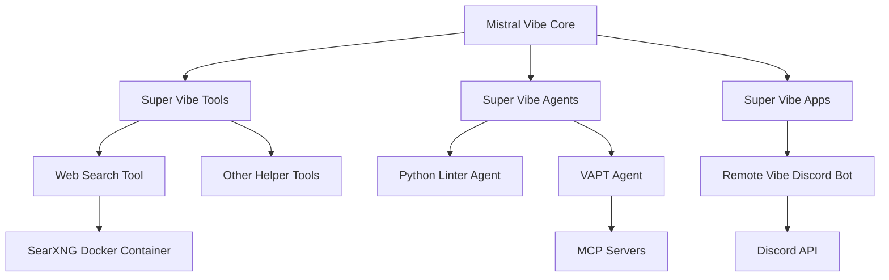

# Super Vibe

Super Vibe is a companion project to [Mistral Vibe](https://github.com/mistralai/mistral-vibe) that provides additional helper tools to enhance your coding assistant experience. It extends the capabilities of Mistral Vibe by adding powerful features for web search, code analysis, and remote control.

## Features

### 🔍 Web Search Tool

The Web Search Tool integrates SearXNG as a privacy-focused web search engine to fetch information from the web directly within your Vibe environment. This allows your AI assistant to:

- **Search the web** for up-to-date information using natural language queries
- **Fetch and analyze web pages** by extracting content and converting it to markdown
- **Perform advanced searches** with filters like language, categories, and safe search levels
- **Retrieve structured data** from websites for analysis and processing

The tool uses a local SearXNG instance running in Docker, ensuring your search queries remain private and under your control.

### 🐍 Python Linter Agent

The Python Linter Agent is an intelligent code analysis tool that helps maintain high code quality by enforcing comprehensive Python coding guidelines. It provides:

- **Automated linting** to catch syntax errors and style violations
- **Type checking** to ensure proper type annotations and prevent runtime errors
- **Code structure analysis** to enforce best practices like single responsibility principle
- **Naming convention enforcement** to maintain consistent and descriptive variable names
- **Documentation review** to ensure proper docstrings and comments
- **Testing guidelines** to promote robust and maintainable test suites

The agent follows a strict priority system:
- ⭐⭐⭐ **Mandatory**: Must be followed strictly
- ⭐⭐ **Highly Recommended**: Should be followed unless there's a strong reason not to
- ⭐ **Advice**: Good practices to consider

### 🤖 Remote Vibe

Remote Vibe is a Discord bot that enables remote control of Devstral and OpenCode sessions through Discord channels. This powerful feature allows you to:

- **Control coding sessions** on remote machines via Discord messages
- **Manage multiple projects** with dedicated channels for each project
- **Collaborate with team members** through Discord's interface
- **Monitor session status** with visual indicators (✅ for success, ❌ for errors)
- **Handle long prompts** by sending messages as file attachments
- **Control access** with fine-grained Discord permissions

Each project gets its own Discord channel, and you can control OpenCode sessions by simply sending messages to the appropriate channel. The bot maintains state in a local SQLite database and requires minimal setup.

### 🛡️ VAPT Agent (Vulnerability Assessment and Penetration Testing)

The VAPT Agent integrates with MCP (Multi-Tool Command Platform) servers to perform security testing. It allows you to:

- **Connect to MCP servers** like Hexstrike for automated security testing
- **Run vulnerability scans** on your codebase and infrastructure
- **Perform penetration testing** using multiple security tools
- **Analyze security findings** and generate reports

This agent is particularly useful for security-conscious development teams who want to integrate security testing into their development workflow.

## How Super Vibe Works

Super Vibe extends Mistral Vibe by providing additional tools and agents that integrate seamlessly with the core Vibe framework. Here's how the components work together:

### Architecture Overview



### Integration Points

1. **Tools Integration**: Super Vibe tools are registered with Mistral Vibe's tool system, making them available as additional capabilities for your AI assistant.

2. **Agents Integration**: Super Vibe agents extend Mistral Vibe's agent framework, providing specialized behaviors for code analysis and security testing.

3. **Apps Integration**: Super Vibe apps like Remote Vibe run independently but communicate with Mistral Vibe instances to control coding sessions.

### Data Flow

- **Web Search**: User request → Vibe → Web Search Tool → SearXNG → Web → Results back to user
- **Code Analysis**: User request → Vibe → Python Linter Agent → Codebase analysis → Recommendations to user
- **Remote Control**: Discord message → Remote Vibe bot → Mistral Vibe instance → Session execution → Results to Discord
- **Security Testing**: User request → Vibe → VAPT Agent → MCP Server → Security tools → Analysis results

## Installation

### Prerequisites

1. Install Docker on your system
2. Have Mistral Vibe installed and configured

### Setting up SearXNG for Web Search Tool

1. Navigate to the helpers directory:
   ```bash
   cd helpers/searxng
   ```

2. Start SearXNG using Docker Compose:
   ```bash
   docker compose -f docker-compose.yml up -d
   ```

3. Test that SearXNG is running by visiting http://localhost:8888/

### Installing Super Vibe Tools

1. Create the Vibe tools directory if it doesn't exist:
   ```bash
   mkdir -p ~/.vibe/tools
   mkdir -p ~/.vibe/prompts
   ```

2. Symlink the tools to your Vibe installation:
   ```bash
   ln -sf <super-vibe-path>/tools/web_search.py ~/.vibe/tools/
   ln -sf <super-vibe-path>/prompts/web_search.md ~/.vibe/prompts/
   ```

   Alternatively, you can symlink these in your specific project directory instead of globally.

### Installing Super Vibe Agents

1. Create the Vibe agents director if it doesn't exist:
   ```bash
   mkdir -p ~/.vibe/agents
   mkdir -p ~/.vibe/prompts
   ```

2. Symlink the tools to your Vibe installation:
   ```bash
   ln -s <super-vibe-path>/agents/python_linter.toml ~/.vibe/agents/python_linter.toml
   ln -s <super-vibe-path>/prompts/python_linter.md ~/.vibe/tools/prompts/python_linter.md

   ln -s <super-vibe-path>/agents/vapt_agent.toml ~/.vibe/agents/vapt_agent.toml
   ln -s <super-vibe-path>/prompts/vapt_agent.md ~/.vibe/tools/prompts/vapt_agent.md
   ```

### Setting up Remote Vibe

1. Navigate to the remote-vibe directory:
   ```bash
   cd apps/remote-vibe/discord
   ```

2. Install dependencies:
   ```bash
   pnpm install
   ```

3. Run the development server:
   ```bash
   pnpm dev
   ```

4. Follow the CLI prompts to configure your Discord bot and API keys

### Setting up MCPs

We have VAPT agent that uses MCPs to conduct VAPT testing. Here's an example of how to set it up:

1. Follow the instructions here - https://github.com/0x4m4/hexstrike-ai (i.e clone the repo, setup venv and install deps)

2. Install as many security tools as you can (Instructions to setup popular tools are provided in the repo ^)

3. Once done, start the MCP server `python3 hexstrike_server.py --port 8889`

4. Change the hexstrike python path in vapt_agent.toml file with your system's directory path

5. Once done, you can instantiate the VAPT agent that uses your MCP with `vibe --agent vapt_agent`

### Configuration

By default, SearXNG runs on port 8888. If you change the port, update the configuration in your `config.toml`:

```toml
[tools.web_search]
searxng_url = "http://localhost:YOUR_PORT"
```

## Use Cases

Super Vibe is designed to enhance your development workflow in various scenarios:

### For Individual Developers

- **Research and Learning**: Use the Web Search Tool to quickly find documentation, tutorials, and examples without leaving your coding environment.
- **Code Quality**: Run the Python Linter Agent to automatically check your code against best practices and catch potential issues early.
- **Remote Development**: Control coding sessions on your home computer from anywhere using Remote Vibe through Discord.

### For Development Teams

- **Code Reviews**: Use the Python Linter Agent to standardize code quality across your team and enforce consistent coding guidelines.
- **Knowledge Sharing**: Team members can share web research findings directly through the AI assistant.
- **Collaborative Development**: Multiple team members can control and monitor coding sessions through Discord channels.
- **Security Integration**: Run regular security scans using the VAPT Agent to identify vulnerabilities early in the development cycle.

### For DevOps and Security Teams

- **Automated Security Testing**: Integrate the VAPT Agent into your CI/CD pipeline to run vulnerability assessments automatically.
- **Infrastructure Analysis**: Use web search capabilities to gather information about security best practices and emerging threats.
- **Remote Troubleshooting**: Diagnose and fix issues on remote servers using Remote Vibe's Discord interface.

### For AI Assistant Enthusiasts

- **Extended Capabilities**: Enhance your Mistral Vibe installation with additional tools that make your AI assistant more powerful.
- **Customization**: Tailor the Python Linter Agent to enforce your team's specific coding standards.
- **Multi-Platform Control**: Manage coding sessions across different machines and environments from a single Discord interface.

## Usage

### Web Search

You can now use the web search tool directly in Vibe:

```
> Search for 'Siddhartha Gunti' and tell me what you find
```

Or provide a direct link for analysis:

```
> Can you tell me how to implement MCPs in Vibe - https://github.com/mistralai/mistral-vibe
```

### Coding Guidelines Agent

You can start Vibe with `vibe --agent python_linter` to start in the agent mode.

### Remote Vibe

Once configured, you can control OpenCode sessions in any computer via Discord channels. Each project gets its own channel where you can send messages to control the OpenCode session.

## Benefits of Using Super Vibe

### Compared to Standard Mistral Vibe

| Feature | Standard Mistral Vibe | Super Vibe Enhanced |
|---------|----------------------|---------------------|
| **Web Search** | ❌ Limited to local knowledge | ✅ Full web search capabilities |
| **Code Analysis** | ❌ Basic syntax checking | ✅ Comprehensive linting and best practices |
| **Remote Control** | ❌ Local only | ✅ Discord-based remote session control |
| **Security Testing** | ❌ None | ✅ Integrated VAPT capabilities |
| **Privacy** | ✅ Local processing | ✅ Local processing + private web search |
| **Collaboration** | ❌ Single user | ✅ Team collaboration via Discord |

### Key Advantages

1. **Enhanced Productivity**: Access web information and perform complex code analysis without switching contexts.

2. **Improved Code Quality**: Automated enforcement of comprehensive Python coding standards.

3. **Remote Flexibility**: Control coding sessions from anywhere using Discord's familiar interface.

4. **Security Integration**: Built-in vulnerability assessment and penetration testing capabilities.

5. **Privacy-First Design**: All tools run locally or use self-hosted services (like SearXNG) to maintain data privacy.

6. **Team Collaboration**: Multiple developers can interact with the same coding sessions through Discord.

## Project Structure

```
super-vibe/
├── apps/
│   └── remote-vibe/          # Remote Vibe Discord bot
│       ├── discord/          # Discord bot implementation
│       └── ...
├── helpers/
│   └── searxng/              # SearXNG web search
│       ├── config/          # SearXNG configuration files
│       │   └── settings.yml
│       ├── data/            # SearXNG data directory
│       └── docker-compose.yml
├── prompts/
│   └── web_search.md        # Web search tool prompt
├── tools/
│   └── web_search.py        # Web search tool implementation
└── README.md                # This file
```

## Contributing

Contributions are welcome! Please feel free to submit pull requests or open issues for:

- New helper tools
- Bug fixes
- Documentation improvements
- Feature enhancements

## License

Copyright 2025 Siddhartha Gunti

Licensed under the Apache License, Version 2.0 (the "License");
you may not use this file except in compliance with the License.
You may obtain a copy of the License at

    http://www.apache.org/licenses/LICENSE-2.0

Unless required by applicable law or agreed to in writing, software
distributed under the License is distributed on an "AS IS" BASIS,
WITHOUT WARRANTIES OR CONDITIONS OF ANY KIND, either express or implied.
See the LICENSE file for the full license text.

## Acknowledgments

- Built on top of [Mistral Vibe](https://github.com/mistralai/mistral-vibe)
- Uses [SearXNG](https://github.com/searxng/searxng) for web search functionality
- Inspired by [Kimaki](https://github.com/remorses/kimaki) for the remote control starter
